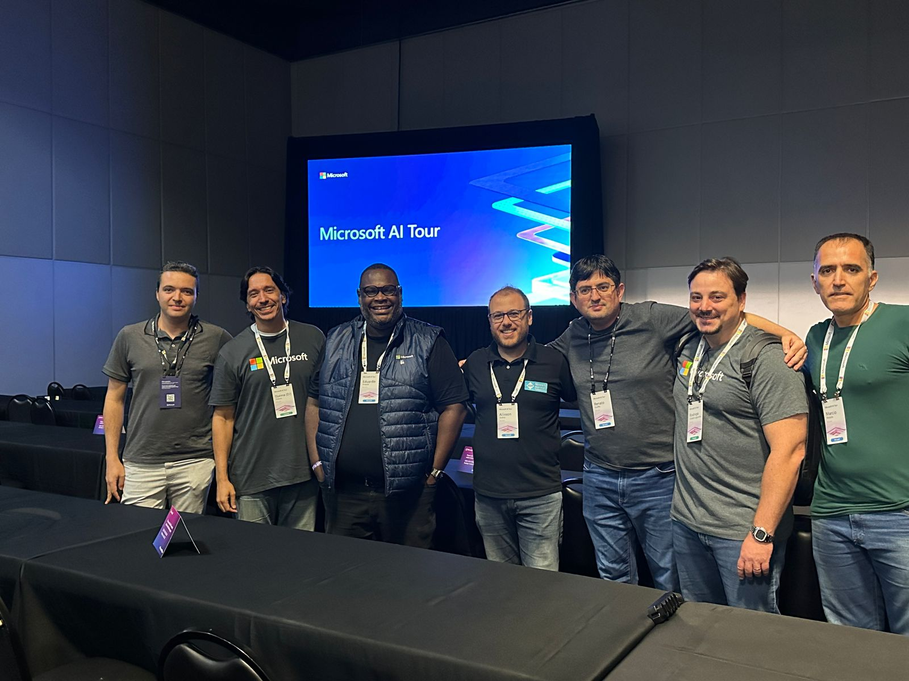

# CopilotStudio-MicrosoftAITour-2024
Fotos e informações gerais sobre minha participação nas 2 sessões do workshop "Build your own Copilots with Microsoft Copilot Studio", durante o Microsoft AI Tour em São Paulo-SP  no dia 21/03/2024.

---

Título do Workshop: **Build your own Copilots with Microsoft Copilot Studio**

Evento: **Microsoft AI Tour - São Paulo**

Tecnologias abordadas: **Microsoft Copilot Studio, Power Automate, .NET, ASP.NET Core, Visual Studio 2022**

Local: **Transamerica Expo Center - Av. Dr. Mário Vilas Boas Rodrigues, 387 - Santo Amaro - São Paulo - SP - CEP: 04757-020**

Speakers:
- **Renato Groffe (Microsoft MVP, MTAC)**
- **Allisson Scalco (Microsoft MVP)**

Monitores (Proctors):
- **Renato Groffe (Microsoft MVP, MTAC)**
- **Allisson Scalco (Microsoft MVP)**
- **Eduardo Amaral (Microsoft MVP)**
- **Marcelo Paiva (Microsoft MVP)**

Foram 2 sessões durante a tarde, com fotos das mesmas abaixo e nas sessões seguintes deste documento:

---

## 1a Sessão

Link no site oficial: [**Sessão 1**](https://envision.microsoft.com/en-US/sessions/4639dd18-463a-45ce-864b-ed5367a8365a?source=sessions)

Horário: **2:30 PM - 3:45 PM**

adfad

adagag

---

## 2a Sessão

Link no site oficial: [**Sessão 2**](https://envision.microsoft.com/en-US/sessions/58370dcc-019c-4fee-8c7b-53e9f99be2b1?source=sessions)

Horário: **4:45 PM - 6:00 PM**

adag aga

agadgag