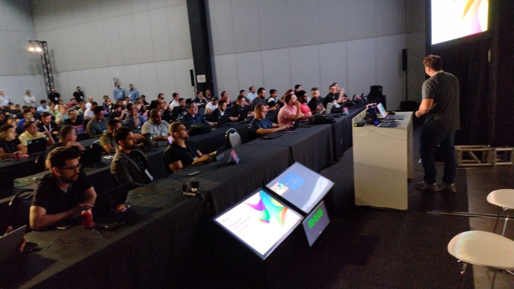
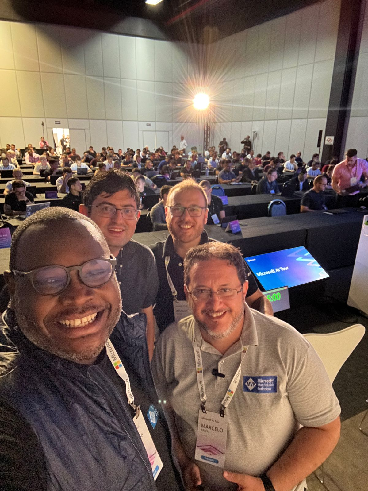

# CopilotStudio-MicrosoftAITour-2024
Fotos e informações gerais sobre minha participação nas 2 sessões do workshop "Build your own Copilots with Microsoft Copilot Studio", durante o Microsoft AI Tour em São Paulo-SP  no dia 21/03/2024.

---

Título do Workshop: **Build your own Copilots with Microsoft Copilot Studio**

Evento: **Microsoft AI Tour - São Paulo**

Data: **21/03/2024 (quinta-feira)**

Tecnologias abordadas: **Microsoft Copilot Studio, Power Automate, .NET, ASP.NET Core, Visual Studio 2022**

Local: **Transamerica Expo Center - Av. Dr. Mário Vilas Boas Rodrigues, 387 - Santo Amaro - São Paulo - SP - CEP: 04757-020**

Público total das sessões: **200 pessoas**

Speakers:
- **Rodrigo Cristelli Lugarinho (Microsoft)**
- **Djalma Franco (Microsoft)**

Monitores (Proctors):
- **Renato Groffe (Microsoft MVP)**
- **Allisson Scalco (Microsoft MVP)**
- **Eduardo Amaral (Microsoft MVP)**
- **Marcelo Paiva (Microsoft MVP)**

Deixamos aqui meus agradecimentos:
- Ao **Rodrigo Cristelli Lugarinho** e ao **Djalma Franco** por todo o apoio e pela oportunidade em auxiliá-los durante o evento.
- Ao **Victor Temple (Microsoft Reactor)** e à **Larissa Cyganski (Microsoft Reactor)** pelo convite.
- E aos amigos **Allisson Scalco**, **Eduardo Amaral** e **Marcelo Paiva** que estiveram juntos comigo nesta iniciativa.

Foram 2 sessões durante a tarde, com fotos das mesmas abaixo e nas sessões seguintes deste documento:

---

## 1a Sessão

Link no site oficial: [**Sessão 1**](https://envision.microsoft.com/en-US/sessions/4639dd18-463a-45ce-864b-ed5367a8365a?source=sessions)

Horário: **2:30 PM - 3:45 PM**

Público que acompanha a sessão: **120 pessoas**

---

## 2a Sessão

Link no site oficial: [**Sessão 2**](https://envision.microsoft.com/en-US/sessions/58370dcc-019c-4fee-8c7b-53e9f99be2b1?source=sessions)

Horário: **4:45 PM - 6:00 PM**

Público que acompanha a sessão: **80 pessoas**

